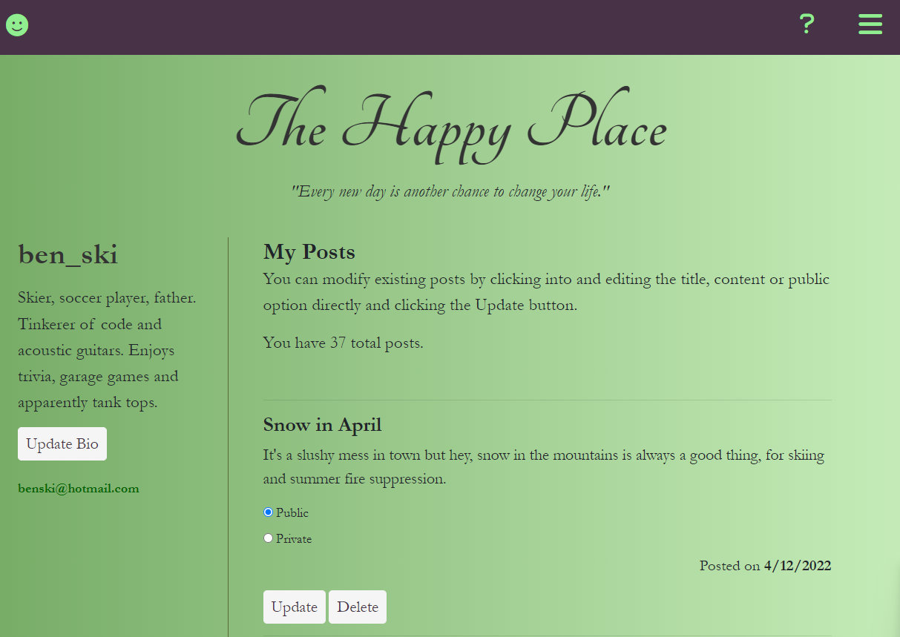

# The Happy Place

## Description
**The Happy Place :)** is an app that allows users to journal daily gratitudes or on subjects that contribute to their wellbeing, and mental health. Users can use this as a private diary, or share their posts publicly. 

**As social media has become an increasingly toxic environment driven by a need for instant gratification** our app will not be based on interaction through comments or likes, and instead will focus on the value of journaling positive experiences.

**USER Story**
- When I visit the site I can see public past and present posts shared by all users
- As a USER I can login using a username and password, or sign up to create an account
- My profile includes an email address and a bio that I can edit and other users can see when logged in
- Once logged in I can create new posts or edit and delete older ones. Posts are set to either public or private
- I am able to view the public posts of other users by user
- I can switch the post view to see either all public posts or my own public and private posts so that the site functions more like a personal journal

<strong>Table of Contents</strong>

- [Credits, Languages and Skills](#credits-languages-and-skills)
- [Installation](#installation)
- [Usage](#usage)
- [License](#license)
- [Contributing Guidelines](#contributing-guidelines)
- [Tests](#tests)
- [Screenshots](#screenshots)
- [Questions and Links](#questions-and-links)
- [Details and Learnings](#details-and-learnings)

## Credits, Languages and Skills

This app was built using MVC architecture and contributions from the following:
- [benfok](https://github.com/benfok/): Back-end Javascript, authentication, webserver config and custom RESTful API routes. Front-end Handlebars rendering and responsive CSS.
- [mlfitz2](https://github.com/mlfitz2): Back-end Javascript, MySQL schema and seed data, Sequlize models. Front-end CSS styling.
- [JonHB82](https://github.com/JonHB82): Front-end CSS framework.
- [Dan-Klo](https://github.com/Dan-Klo): Utility, project planning and documentation.

### Languages and Modules Used
- JavaScript
- MySQL
- Handlebars.js
- Sequelize.js
- Node.js
- Dependencies:
  - [express](https://www.npmjs.com/package/express) as a web framework for Node.js.
  - [express-session](https://www.npmjs.com/package/express-session) middleware to create a session variable for persistent logged in status handling
  - [express-handlebars](https://www.npmjs.com/package/express-handlebars) a handlebars view engine for express
  - [bcrypt](https://www.npmjs.com/package/bcrypt) module for password encryption for sign-up and login functionality
  - [mysql2](https://www.npmjs.com/package/mysql2) for executing SQL code
  - [sequelize](https://www.npmjs.com/package/sequelize) to create SQL models and relationships using JS sytnax
  - [dotenv](https://www.npmjs.com/package/dotenv) used to host credentials in an environment file 
  - [connect-session-sequelize](https://www.npmjs.com/package/connect-session-sequelize) SQL session store using Sequelize.js
  - [date-fns](https://www.npmjs.com/package/date-fns) Date/Time simplification

## Installation
### Local Installation
- Clone the repo.
- Navigate to the folder and run `npm init` followed by `npm install` in order to install the dependencies.
- Be sure to add your MySQL username and password to the .env.EXAMPLE file and rename to .env.
- Using your preferred CLI to execute MySQL, run the schema.sql to create the database.
- Then run `node seeds/index.js` from the command line in order to populate the database.
- The application can be run by executing `node server.js` into your terminal and navigating to http://localhost:3001/.

## Usage
To use the application sign-up by creating your own user or use any of the usernames and passwords stored in the seeds/userData.json file to login as one of the ficticious users. 

## License
Distributed under the **MIT** license.

## Contributing Guidelines
Contributions help our open source community to continue to evolve, and any contributions are greatly appreciated. If you have a suggestion that would improve this code please follow the directions below. I require that any and all changes adhere to the Code of Conduct outlined in the [Contributor Covenant](https://www.contributor-covenant.org/).

 - Fork the repo
 - Create your feature branch
 - Commit your changes
 - Push the branch and open a pull request

> _**Note:** Any contributions are understood to be under the same MIT that covers the project._

## Tests
There are currently no tests written for this application.

## Screenshots
Here are some screenshots of the deployed application

## Questions and Links
Please reach out with any questions regarding the application.

The forked repository in [GitHub](https://github.com/benfok/the-happy-place-forked)

The deployed application on [Heroku](https://the-happy-place-app.herokuapp.com/)

## Details and Learnings
- The application is responsive to different screen widths allowing for an unlimited number of posts for a given day to render smoothly
- The instructions and new post modals allow for uncluttered page viewing and an effective UX
- The user can set a private flag on the feed view to toggle between a journal view or public view. This flag is carried across all date pages of the feed via the URL and links generated by the handlebars code
- Validation exists on all entry fields including email, password and when creating a post
- Posts that are edited or private contain flags denoting them as such
- This application uses the hierarchical structure of MVC - Model, View Controller - in order to separate concerns and functionality
- This structure and the use of handlebars.js for templating and rendering dynamic HTML meant a clean and structured code base with great scalability

- Some considerations for future development include:
  - Rendering a 404 page for invalid URLs
  - The ability to share private posts with particular users to render on their feeds
  - The functionality to set goals and track personal post counts to help form healthy journaling habits

